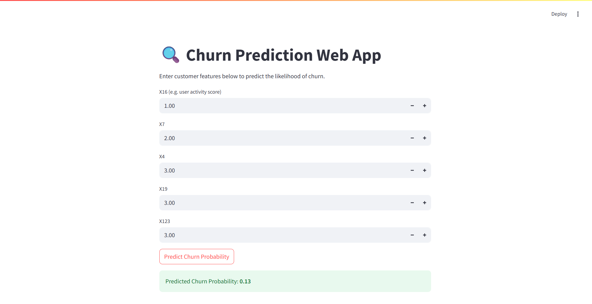

# 📉 Customer Churn Prediction

A full ML pipeline for predicting customer churn using high-dimensional customer data.  
Includes EDA, model comparison, and a real-time Streamlit-based web app.

---

## 📸 Streamlit App Screenshot



---

## 🧠 Problem Statement

Predict whether a customer is likely to churn based on their historical behavior using ML.

Dataset Details:
- ~167,000 rows
- 215 anonymized features (X0 to X214)
- Binary target column: `Churn`

---

## 🧪 Models Tried

| Model              | Accuracy | F1 Score | ROC-AUC |
|-------------------|----------|----------|---------|
| ✅ Random Forest   | 100%     | 1.00     | ~1.00   |
| XGBoost            | 100%     | 1.00     | ~0.999  |
| Logistic Regression| ~49%     | 0.49     | ~0.50   |

Final model: **Random Forest**

---

## 🚀 Streamlit Web App

Run the app locally:
```bash
streamlit run churn_app.py
