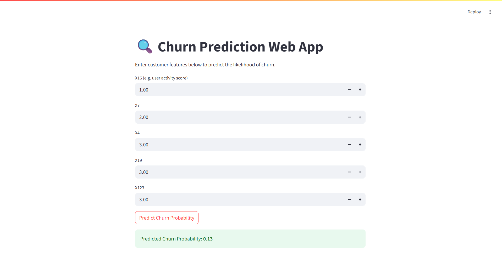

# 📉 Customer Churn Prediction

A complete end-to-end machine learning pipeline to predict customer churn using a high-dimensional real-world dataset.  
This project covers data preprocessing, EDA, model development, rigorous evaluation, and an interactive web app built with Streamlit.


> **Scope & status:** This repository demonstrates the **end-to-end ML workflow and engineering** (EDA → preprocessing → multi-model comparison → Streamlit deployment), **not** a reproducible benchmark. The original dataset is **proprietary and unavailable**, so the results here cannot be independently reproduced and the reported metrics should **not** be read as validated performance (see *Models Compared* below). A future version will be **rebuilt on a fully public churn dataset** for complete reproducibility.

---

## 📸 Streamlit App Screenshot



---

## 🧠 Problem Statement

The goal is to accurately predict if a customer will churn, using anonymized behavioral data.

**Dataset Overview:**
- ~167,000 records
- 215 numerical features (`X0` to `X214`)
- Target variable: `Target_ChurnFlag` (0 = Not Churned, 1 = Churned)


## 🔍 Exploratory Data Analysis (EDA)

- **Class Distribution**: 60% retained, 40% churned
- **Missing Data**: Handled via median imputation
- **Noise Removal**: Non-numeric anomalies like "14 month lease" removed
- **Feature Correlation**: Validated with heatmaps and KDE plots


## ⚙️ Modeling Workflow

- **Preprocessing**: Stratified 80:20 split, median imputation
- **Validation**: 5-Fold Cross-Validation
- **Metrics Used**: ROC-AUC (primary), Accuracy, F1 Score, Confusion Matrix

> **Note:** The original dataset is proprietary and therefore is not included in this repository.

---

## 🧪 Models Compared

| Model               | Accuracy | F1 Score | ROC-AUC | Remarks               |
|---------------------|----------|----------|---------|------------------------|
| ✅ Random Forest     | 100%     | 1.00     | ~1.00   | Final model            |
| XGBoost              | 100%     | 1.00     | ~0.999  | Close second           |
| Gradient Boosting    | 100%     | 1.00     | ~1.00   | Equally strong         |
| LightGBM             | 100%     | 1.00     | ~1.00   | Slight warnings        |
| Logistic Regression  | ~49%     | 0.49     | ~0.50   | Weak baseline          |


> **Note on metrics:** the tree-based models reported near-perfect scores on the original proprietary dataset, but that result is **not trustworthy**. With the strongest feature-to-target correlation only ≈0.10, near-perfect accuracy across *every* model indicates a **data artifact (likely duplicate records and/or a leaked high-cardinality field)** rather than genuine predictive skill. Because the dataset is unavailable this can't be diagnosed or corrected here, so **no performance numbers are claimed**. The planned public-dataset rebuild will report honest, validated metrics.


## 🏆 Final Model

The Random Forest classifier was selected as the final model for the accompanying Streamlit application based on the original project evaluation.

This repository focuses on demonstrating the end-to-end machine learning engineering workflow, including preprocessing, feature engineering, model comparison, evaluation, and deployment.


## 🔬 Model Interpretability

- Top 5 Features: `X16`, `X7`, `X4`, `X19`, `X123`
- Used for UI simplicity — full model trained on all 215 features
- Techniques:
  - Feature Importance (Random Forest)
  - Correlation Heatmap
  - KDE plots


## 🚀 Streamlit Web App

You can run the app locally:

```bash
streamlit run churn_app.py
````

* Input: 5 most important features
* Output: Predicted churn probability (e.g., 13%)


## 🖥️ Streamlit App Screenshot


## 🧰 Tech Stack

* **Python**
* **pandas, numpy, scikit-learn**
* **xgboost, lightgbm**
* **matplotlib, seaborn**
* **streamlit**
* **joblib** (for model loading)


## 📁 Project Structure

```
Customer-Churn-Prediction/
├── churn_app.py
├── random_forest_model.pkl
├── Assignment1.ipynb
├── app_screenshot.png
├── requirements.txt
└── README.md
```


## 🎯 Key Learnings

* Detected and addressed model overfitting
* Balanced model performance with deployment simplicity
* Understood real-world ML model evaluation cycles
* Delivered insights through EDA and feature analysis
* Built a working UI with real-time prediction logic


## 🔮 Future Enhancements

* Add SHAP visualizations for interpretability
* Deploy app on Render or HuggingFace Spaces
* Map feature codes (X0–X214) to actual business features
* Add periodic retraining pipeline


## 🙋‍♂️ Author

**Divyansh Gautam**
📬 [divyanshgautam0410@gmail.com](mailto:divyanshgautam0410@gmail.com)

